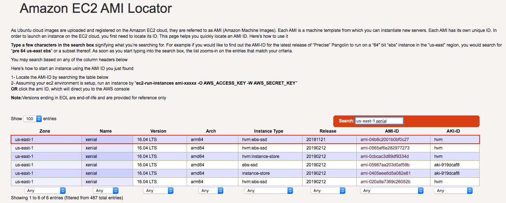
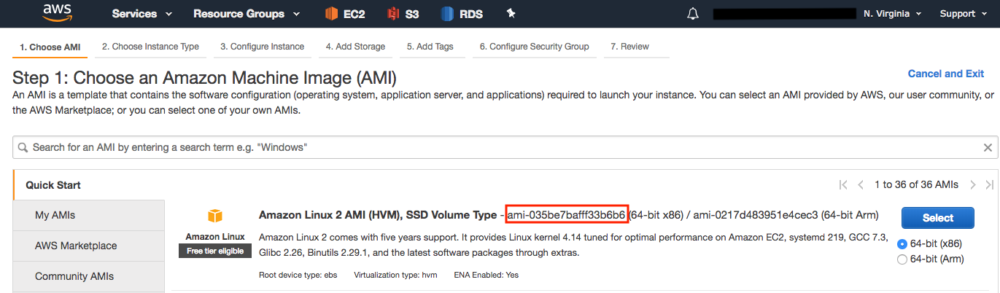

# Terraform Resources

&nbsp;

## Table of contents
- Installing Terraform
  - [Install Terraform on macOS](#install-terraform-on-macos)
  - [Install Terraform using Vagrant](https://github.com/sayems/vagrant.resources#table-of-contents)
- [Build Infrastructure](#build-infrastructure)
  - [Variable Configuration](#variable-configuration)
  - [Configuration File](#configuration-file)
- [Change Infrastructure](#change-infrastructure)
- [Destroy Infrastructure](#destroy-infrastructure)
- [Resource Dependencies](#resource-dependencies)
- [Useful Commands](#useful-commands)


&nbsp;


Install Terraform on macOS
--
The easiest and quickest way to install Terraform is using Homebrew.
```
brew install terraform
```


[top](#table-of-contents)
&nbsp;


Build Infrastructure
--

You can find the latest Ubuntu AMI by going to their [Amazon EC2 AMI Locator page](https://cloud-images.ubuntu.com/locator/ec2/)



&nbsp;
or 
&nbsp;



&nbsp;

#### Variable Configuration

1. Copy and paste the following text to file named: ```terraform.tfvars```
```
AWS_ACCESS_KEY="..."
AWS_SECRET_KEY="..."

```
Make sure you replace ```...``` three dots with your credentials from AWS console. 

#### Configuration File

2. Copy and paste the following text below to file named: ```terraform.code.tf```
```bash
# ************************
# vars.tf
# ************************
 
variable "AWS_ACCESS_KEY" {}
variable "AWS_SECRET_KEY" {}
variable "AWS_REGION" {
  default = "us-east-1"
}
variable "AMIS" {
  type = "map"
  default = {
    # *******************************************
    # https://cloud-images.ubuntu.com/locator/ec2/
    #
    #   N. Virginia => us-east-1
    #   OS        => UBUNTU Xenial 16.04 LTS
    #   AMI_ID    => ami-245f7fcf
    #
    #   AMI shortcut (AMAZON MACHINE IMAGE)
    #
    # *******************************************
    us-east-1 = "ami-035be7bafff33b6b6"
  }
}
 
# ************************
# provider.tf
# ************************
provider "aws" {
    access_key = "${var.AWS_ACCESS_KEY}"
    secret_key = "${var.AWS_SECRET_KEY}"
    region = "${var.AWS_REGION}"
}
 
 
# ************************
# instance.tf
# ************************
resource "aws_instance" "SELENIUM" {
  ami = "${lookup(var.AMIS, var.AWS_REGION)}"
  tags { Name = "SELENIUM" }
  instance_type = "t2.micro"
  provisioner "local-exec" {
     command = "echo ${aws_instance.SELENIUM.private_ip} >> private_ips.txt"
  }
}
output "ip" {
    value = "${aws_instance.SELENIUM.public_ip}"
}
```

3. Verify these two files exit in your current directory:

- ```terraform.tfvars```
- ```terraform.code.tf```

4. Now you can run:
```
$ terraform init
```
Output after running ```terraform init```
```
Initializing provider plugins...
```
```
$ terraform apply
```
Output after running ```terraform apply```
```
Terraform will perform the following actions:
......

Do you want to perform these actions?
  Terraform will perform the actions described above.
  Only 'yes' will be accepted to approve.

  Enter a value: yes
  
.....
aws_instance.SELENIUM: Still creating... (10s elapsed)
aws_instance.SELENIUM: Still creating... (20s elapsed)
aws_instance.SELENIUM: Still creating... (30s elapsed)
aws_instance.SELENIUM: Provisioning with 'local-exec'...
aws_instance.SELENIUM (local-exec): Executing: ["/bin/sh" "-c" "echo 172.31.17.214 >> private_ips.txt"]
aws_instance.SELENIUM: Creation complete after 32s (ID: i-068bceca356edec95)

Apply complete! Resources: 1 added, 0 changed, 0 destroyed.
```

5. Delete/destroy your instances:
```
$ terraform destroy
```

[top](#table-of-contents)
&nbsp;


Change Infrastructure
--


[top](#table-of-contents)
&nbsp;

Destroy Infrastructure
--
Resources can be destroyed using the ```terraform destroy``` command, which is similar to ```terraform apply``` but it behaves as if all of the resources have been removed from the configuration.

```
$ terraform destroy
```
Output after running ```terraform destroy```
```
Terraform will perform the following actions:
- aws_instance.SELENIUM

Plan: 0 to add, 0 to change, 1 to destroy.

Do you really want to destroy all resources?
  Terraform will destroy all your managed infrastructure, as shown above.
  There is no undo. Only 'yes' will be accepted to confirm.

  Enter a value: yes
```
```
Destroy complete! Resources: 1 destroyed.
```


[top](#table-of-contents)
&nbsp;


Resource Dependencies
--


[top](#table-of-contents)
&nbsp;


&nbsp;

Useful Commands
--

| Commands                            | Description                                          |
|-------------------------------------|------------------------------------------------------|
| $ terraform plan                    | plan                                                 |
| $ terraform apply                   | shortcut for plan & apply - avoid this in production |
| $ terraform plan -out out.terraform | terraform plan and write the plan to out file        |
| $ terraform apply out.terraform     | apply terraform plan using out file                  |
| $ terraform show                    | show current state                                   |
| $ cat terraform.tfstate             | show state in JSON format                            |


[top](#table-of-contents)
&nbsp;
